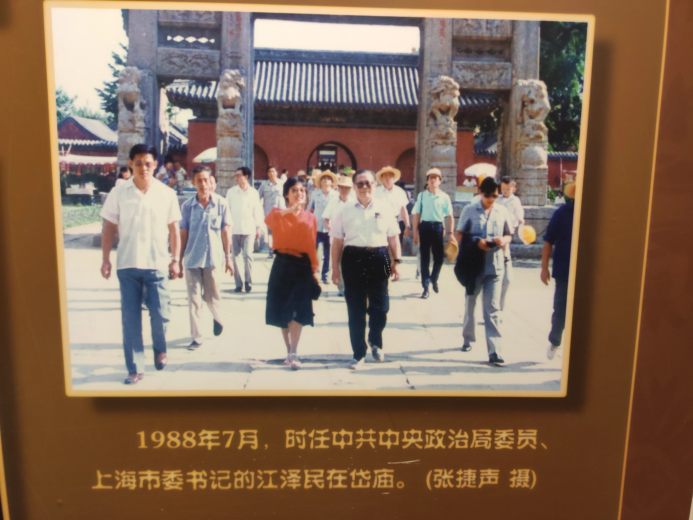
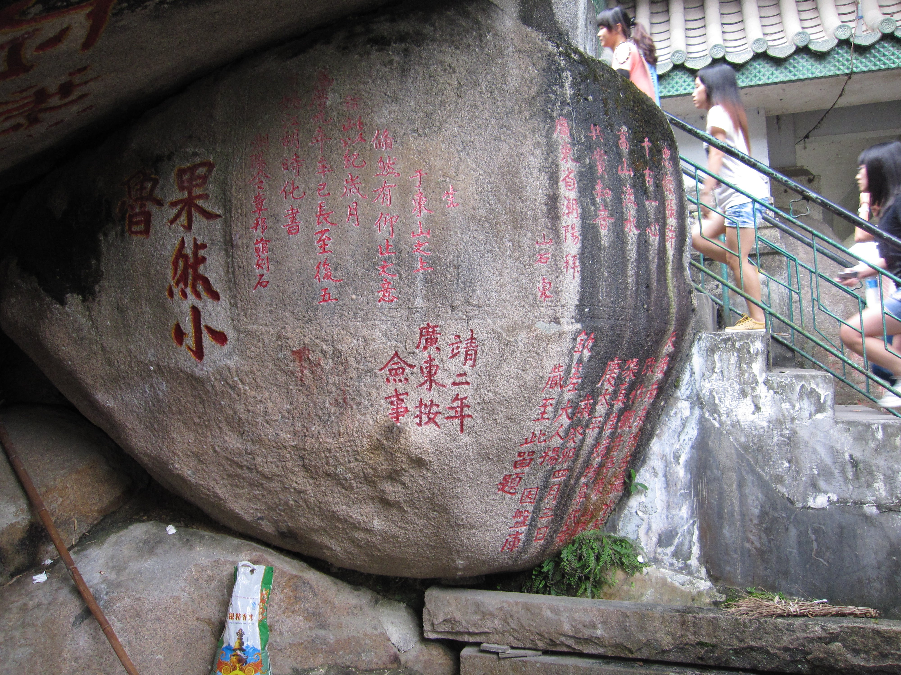
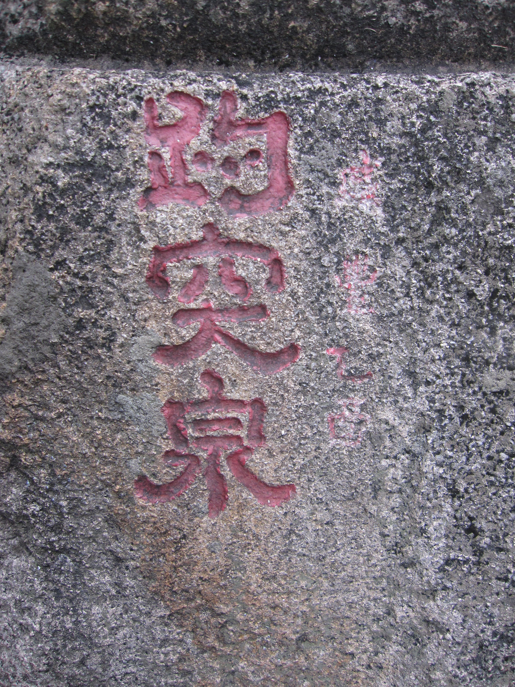
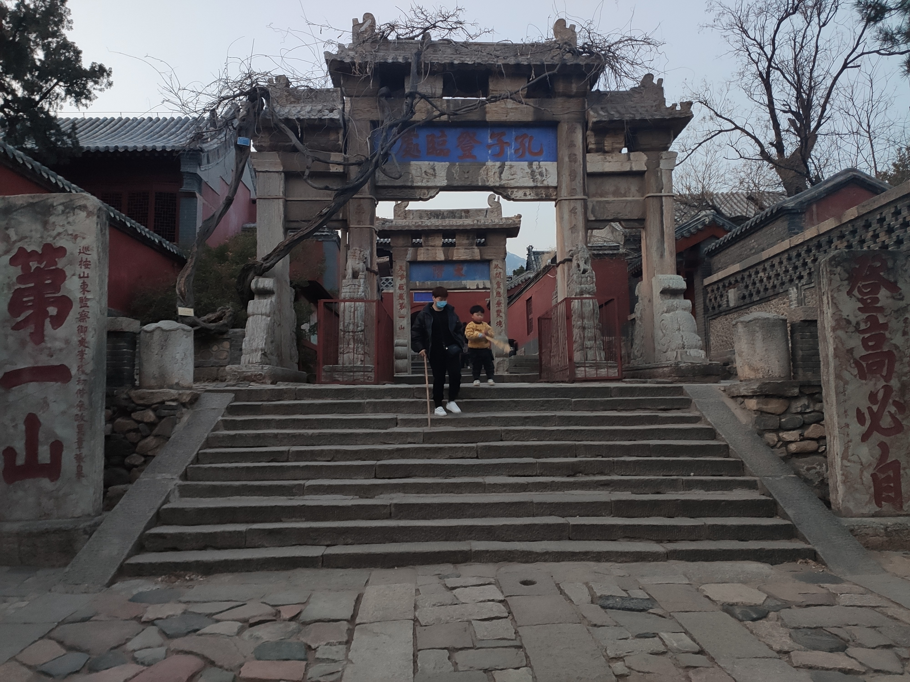
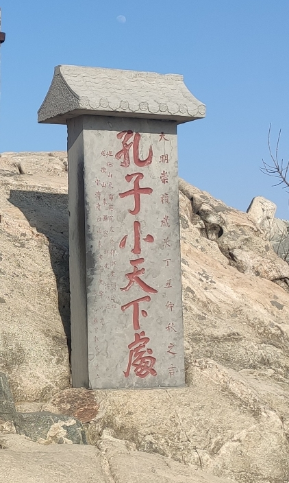
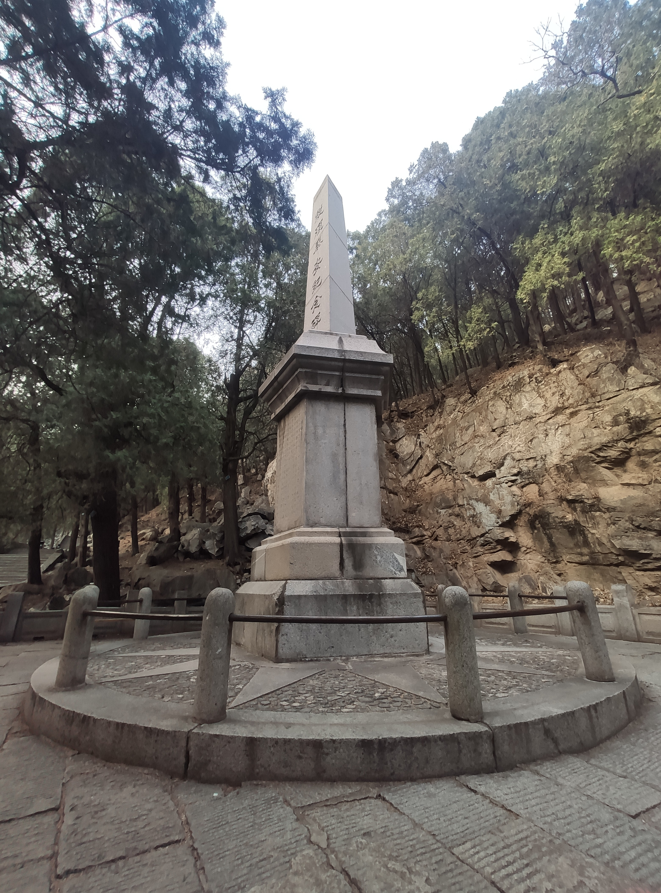
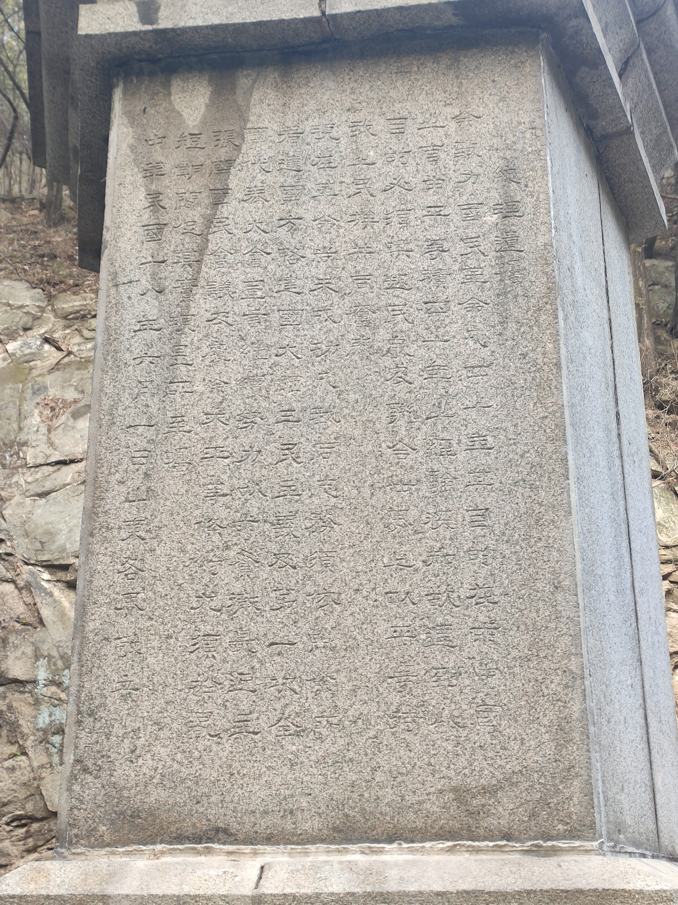
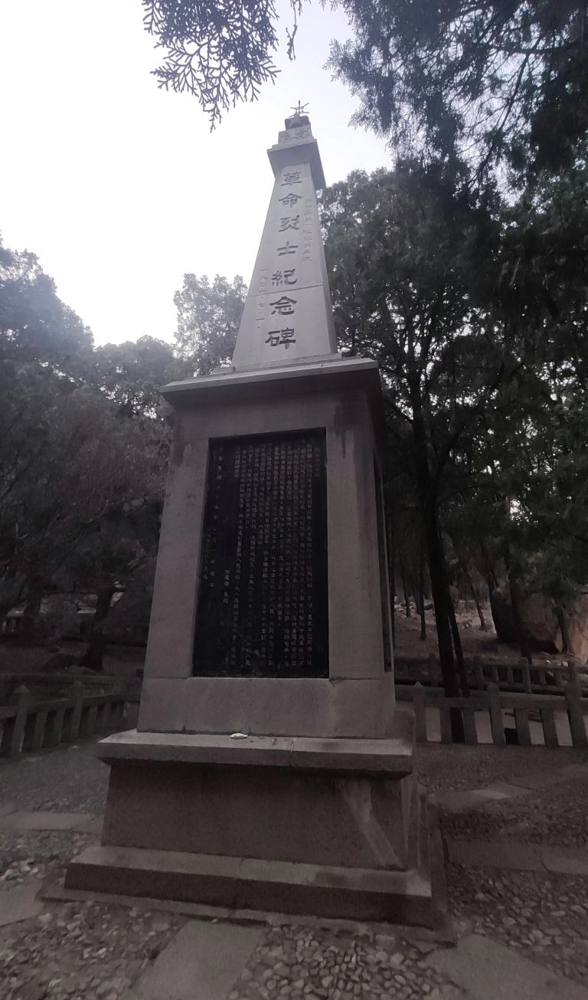
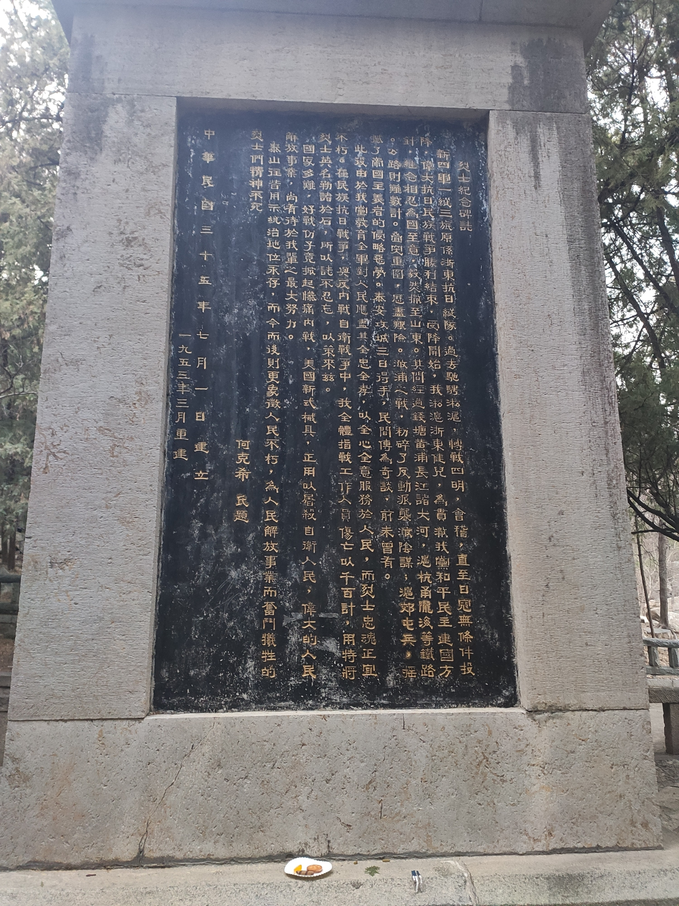
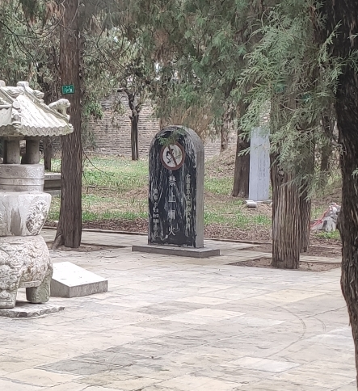

>五岳归来不看山，黄山归来不看岳
>

本来去过黄山的我，以后出游已经不准备爬山了。~~其实是因为懒。~~没想到年才刚过就来到了泰山脚下的山东泰安。
旅行第一站就来到了岱庙。第一印象就是遍地的碑。但是看着看着就感觉到了异样：大部分碑上的字都看不清，甚至有些碑都已经从有字碑变成无字碑了。岱庙还不嫌碑太多，专门从其他地方搬了石碑过来设了个展示馆。

[从肥城搬来的明代筑桥碑，由]~~外星文字~~[明代方形叠篆文体书写]

除了碑以外，不外乎牌坊、松柏、各式木构建筑。自动讲解强调说这里是乾隆待过的迎宾馆，那里是汉武帝种的松柏云云。但是印象最深的居然是岱庙内的博物馆。刚入门就是领导关怀展区，紧接着就是满眼PPT的地狱。直到看到了小展柜里的动物标本我才记起来这里是个博物馆。

[Photos]

[/Photos]

时间来到了第二天，我们来到了大家都喜爱？的泰山。可惜来的时间不佳，树无叶溪无水。只有随处可见的~~乱涂乱画~~摩崖石刻和石碑比较好看了。在潮阳看到的石刻石碑，基本每个碑都要把字涂好涂满。而泰山上看的最清楚的碑文都是什么古今领导的御笔，涂上了红字甚至金字。还有就是几步一见的毛诗。绝对可以称得上政治上的五岳独尊了。
>孔子登东山而小鲁，登泰山而小天下  
--孟子
>

从以前就听过孟子的这句话了，但是一直只记得前半句。因为号称海滨邹鲁的潮阳就有个海拔约两百米的东山，山上石刻写着“果然小鲁”等字样。~~果然有够不要脸。~~百度过后就记住了这句话。

[Photos]

[/Photos]

[Photos]

[/Photos]

下半句我在泰山才完全记住，山上的刻字不只告诉你孔子爬过，还告诉你他在哪里讲的小天下。既然是明朝地方大员讲的，那就一定没错。既然已经接近登顶了，与其看这块~~破~~碑，还不如看看隔壁日观峰上青砖绿瓦的民国建筑：[日观峰气象台](https://zh.wikipedia.org/zh-hans/%E4%B8%AD%E5%9B%BD%E6%B0%94%E8%B1%A1%E5%B1%80)。(见题图，建于1935年，是中国第一座永久性高山气象台。竺可桢亲自选址，蔡元培题写奠基纪念碑，邵元冲题写“日观峰气象台”台名。)

[Photos]

[/Photos]

而说到民国建筑，就不得不提到[总理奉安纪念碑](https://zh.wikipedia.org/zh-hant/%E7%B8%BD%E7%90%86%E5%A5%89%E5%AE%89%E7%B4%80%E5%BF%B5%E7%A2%91)了。该碑为纪念孙中山灵柩奉安南京而立。碑首为三棱碑代表三民主义，碑体为五棱代表五权宪法。台基的国民党党徽十分抢眼。而碑体上的总理遗嘱则全文原生态，读来十分费眼。

[Photos]

[/Photos]

而下方不远处的革命烈士纪念碑待遇则全然不同。不只全碑文字清晰可辨，且碑身上的“烈士纪念碑志”涂为金色，读来十分醒目。此碑为共军攻入泰安时所立，用以纪念攻城的新四军一纵三旅的阵亡将士，碑体周身除碑志外，还一一列明了将士姓名籍贯等信息。国民党军队反攻时摧毁，后又修复。
由此可知，在泰山，只有政治成分好的刻字才值得保护。“不重要”的石刻石碑们就请自求多福吧。

[Photos]

[/Photos]

泰山逛完，泰安也就没什么好留恋的了。下一站我们就来到了孔家店的大本营——曲阜。曲阜最出名即所谓三孔：孔庙、孔府、孔林。即祀孔的庙宇及孔家的宅第、墓园。孔庙和岱庙一样满地的石碑，不一样的是密度更高御笔更多。导游带着我们重点看了各种御笔，表明明代清代各皇帝有多喜欢来孔庙写字。还看了进门的各种题字，表明题字写错有各种理由云云。听来着实让人困倦。孔府的讲解重点即所谓家训，讲孔家家教如何之好，当今领导人如何重视家训云云。还提供了所谓专家东拼西凑的各姓家训供阅读，读不够还可以买下来，一本家训190元哟。
一路听导游所言，似乎孔家嫡系(即衍圣公)就如中学历史课本上的中国一样，道统一直延续至今。到现在也有八十世了，想想神山郑氏到我这一辈也才二十九世，不禁肃然起敬。当然导游不会告诉你，除了曲阜孔家之外，还有从北宋末年因战乱迁徙至浙江衢州的南宗。而后南宗北宗并立直到49年政权更迭，南宗一派选择留下，不再世袭官职；而北宗则去了台湾，从此消失在大陆的官方叙述中。

接下来就到了孔林，浓密的树荫下是无数孔家人的坟冢。然而与公墓不同，这里的坟冢排列稍显杂乱拥挤。且05年后似乎也不能立碑了，想必位置是更为难找，真为扫墓的亲属感到忧心。孔林深处便是孔老夫子和二世祖、三世祖的墓地了。在批林批孔风潮下倒下的夫子墓碑，又重新立起来涂了金字。与或涂红字、或原生态的子孙墓碑简直天渊之别。从政治风暴中的打倒孔家店到尊孔至此，如夫子泉下有知不知会作何感想。
由于孔林太大，导游只带着坐电瓶车逛了一圈才下来步行，感觉比前两座还要走马观花。结果就这样带着轻浮的印象离开了曲阜。

由于行程匆忙，山东之旅就在走马观花中匆匆结束了。在此要多谢泰安友人范氏的远程倾情介绍，给我的游览添了很多趣味。虽然范氏推荐的驴肉火烧没有吃到，奈何桥、冯玉祥墓、泰安老火车站以及壕气的政府也无缘得见了。下次有机会再来拜访。~~下次一定~~
